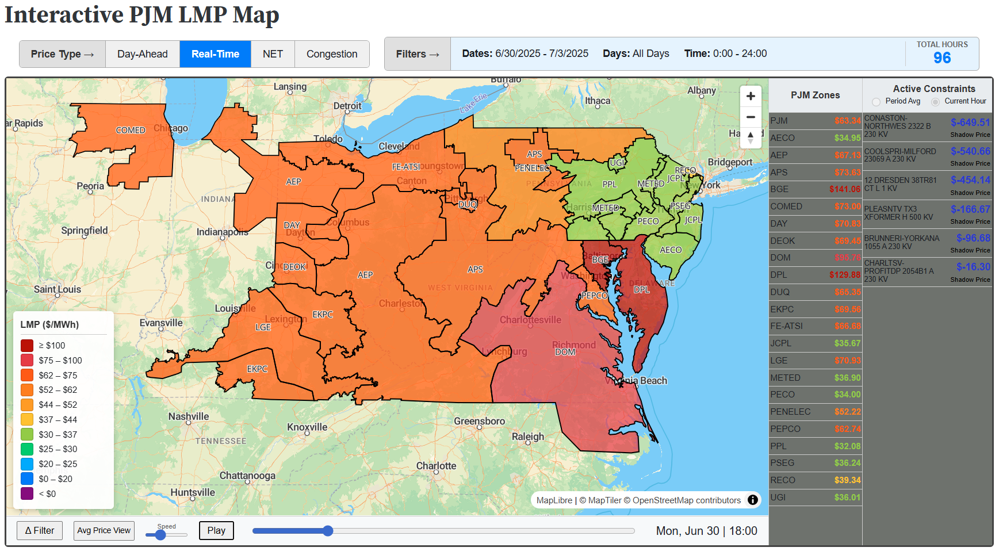
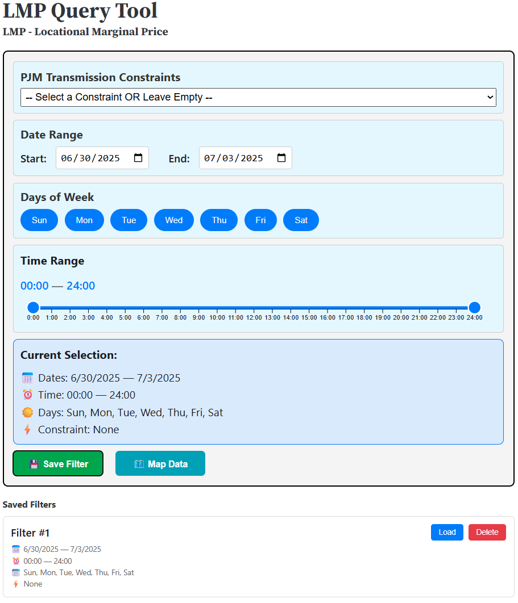
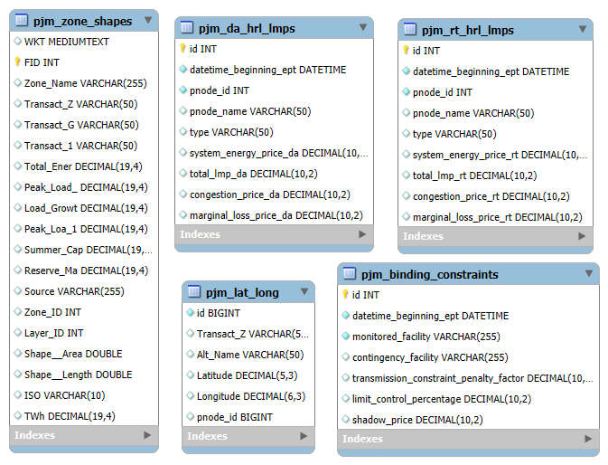

# Semester Project
**Course:** CS7250  
**Term:** Fall 2025 – Professor Bogden  
**Team:** Ben Darby & Ben Henshaw  

---

# It's Electric
### *Visual Analytics for PJM Market Forecasting*

> **Topic:** Forecasting Electricity Prices by Zone using "Like-Day" Historical Price Retrieval and Analysis

---

## Project Overview

### Purpose
**This application serves as a financial risk analysis tool for the PJM wholesale electricity market.**

Large companies often need to balance their purchases and buy extra power, but the final "delivered" price is volatile due to the distance between generation and load. Bottlenecks in the power grid—known as **"congestion"**— can be a very large, unpredictable cost, reaching up to **$100,000 an hour** in recent events for a moderately sized 200MW purchase.

Our app uses historical price data to help users forecast that risk. The workflow allows users to:
1.  **Select a future time period** where they anticipate needing to make a purchase.
2.  **Look up similar system conditions** ("like days") in the past using predictive features.
3.  **Compare known generation offers** against historical performance to determine which options are the most stable and cost-effective.

### The Problem We Address: Congestion & Basis Risk
In ISO markets like PJM, simply securing generation to match your load does not eliminate financial risk. Market participants remain exposed to **price congestion**—the volatile price difference between where energy is generated (Supply) and where it is consumed (Demand).

This "basis risk" cannot be preset. While third-party financial products exist to hedge this risk, purchasing them blindly leaves significant value on the table. To determine the true value of congestion risk, participants must understand the specific **situational context**—analyzing historical "like days" based on:

*   Calendar dates & seasonality
*   Days of the week & Hours of the day
*   Real-time transmission constraints

### Target Audience
This tool is designed for **Procurement Specialists, Energy Traders, Risk Managers, and Market Analysts** who wish to visualize complex inter-zonal relationships.

We specifically target professionals **willing to "do the homework"**—  This tool is for users who aren't satisfied with just asking a broker for their take; it is for those who would rather dig into the data themselves, turning historical patterns into actionable strategies for the Real-Time and Day-Ahead markets.

---

## Interface Preview

<div align="center">
  
  <p><em>The interface allows users to visualize congestion deltas, filter historical data, retrieve summary information, and replay market days hour-by-hour.</em></p>

  <br>

  
  <p><em>The query page allows users to design filters matching specific date, day, time, and congestion conditions. These parameters are dynamically passed to the database to retrieve instant results.</em></p>
</div>

---

## System Architecture

The application is built on a modular architecture to ensure scalability and separation of functionality:

| Component | Tech Stack | Role |
| :--- | :--- | :--- |
| **Data Sources** | PJM Data Miner 2 & ArcGIS Online | Harnesses the PJM "Data Vault" for market data and retrieves GeoShapes for PJM zone geodata. |
| **Database** | AWS RDS (MySQL) | Currently Storing 9GB+ of historical PJM market data. |
| **Frontend** | Observable Framework (JS/D3) | Interactive visualizations and state management. |
| **Mapping** | MapLibre GL JS | High-performance vector tile mapping for zone shapes and ISO border identification. |
| **Backend** | Python (FastAPI) | Handles API requests and executes complex SQL queries. |
| **Version Control** | GitHub | Source code management and team collaboration. |

---

## Reproducibility & Setup

Follow these instructions to clone the repository, configure the environment, and run the application on your local machine.

### 1. Prerequisites
Before you begin, ensure you have the following installed on your system:
- [Git](https://git-scm.com/)
- [Conda](https://docs.conda.io/en/latest/miniconda.html)
- [Node.js & npm](https://nodejs.org/) (Required for Observable Framework)

### 2. Installation

**Clone the Repository**  
All subsequent commands should be run from the project root directory.
```bash
git clone https://github.com/nudataviz/project-fall25-darbyatNE
cd project-fall25-darbyatNE
```

**Verify Directory Structure**  
Ensure the `src/` directory exists and contains `index.html`, `picker.md`, and `backend.py`, and that `src/lib/` contains the necessary component files, `config.js`, `filter.js`, `utils.js`.

### 3. Configuration (.env)

Create a file named `.env` at the project root (`project-fall25-darbyatNE/`). This file is required to connect to the PJM Data API, the AWS RDS instance, and map services.

**Add the following keys to your `.env` file:**
```ini
PJM_API_KEY=your_pjm_api_key_here
USER=database_username
DB_PASSWORD=database_password
DB_NAME=database_name
DB_HOST=aws_rds_endpoint
DB_PORT=3306
BACKEND_URL=http://127.0.0.1:8000
MAP_KEY=your_maptiler_map_key
```

### 4. Environment Setup

Create the Conda environment using the provided YAML file. This installs all necessary Python dependencies.

```bash
# Create the environment from file
conda env create -f lmp_env.yml

# Activate the environment
conda activate lmp-env
```

### 5. Database Setup

Any MySQL database can be used with the API scripts included in this repo. An AWS RDS MySQL instance is used by the authors. The schema for the database is detailed below:

<div align="center">
  
</div>

---

## 6. Populate the Data

This project harnesses the **PJM Data Vault** using the **Data Miner 2** toolset. There are two methods to acquire this data: manual CSV downloads or programmatic ingestion via the PJM API.

#### 1. Data Access
*   **Manual Download (No Account Required):**  
    All PJM data is publicly available and can be downloaded as CSV files via [PJM Data Miner 2](https://dataminer2.pjm.com/list).
*   **Programmatic API Access (Recommended):**  
    To automate data ingestion, you must register for a PJM account and generate a subscription key.  
     [**PJM New User Registration Guide**](https://www.pjm.com/-/media/DotCom/etools/account-manager/new-user-registration-workflows-quick-guide-1.pdf)

#### 2. Running Ingestion Scripts
Once you have an active PJM API Key and have configured your `.env` file, you can utilize the pre-built scripts located in the `src/data` directory.

**Example: Fetching Real-Time Prices**  
The script `pjm_query_rt_lmp.py` fetches Real-Time Locational Marginal Prices (LMPs). Before running, open the file and configure the target parameters (currently lines 23–25):

```python
# Configuration Variables inside pjm_query_rt_lmp.py
START_DATE = "2023-01-01"
END_DATE   = "2023-12-31"
PNODE_IDS  = [12345, 67890] # List of specific PJM Nodes
```

Run the script via terminal:
```bash
python src/data/pjm_query_rt_lmp.py
```

#### 3. AWS & Network Security
If you are connecting to an AWS RDS instance or hosting the backend on EC2, you must configure the **Security Group** rules to allow traffic.

*   **Inbound Rules:**
    *   **Database (MySQL/Aurora):** Allow traffic on Port `3306`.
    *   **API Access:** If hosting the backend remotely, allow traffic on Port `8000`.
*   **Access Control:**
    *   Ensure the Security Group allows traffic **only from the specific IP addresses** of the users who are pinging, filling, or querying the database.

---

## Running the Application

1.  **Start the Observable Framework Application**  
    Run the development server using npm:
    ```bash
    npm run dev
    ```

2.  **Access the Dashboard**  
    Open your web browser and navigate to:
    ```
    http://127.0.0.1:3000
    ```

---

## Feedback & Contact

Feedback and suggestions are welcome! Please send your thoughts to:
*   **Ben Darby:** darby.b@northeastern.edu
*   **Ben Henshaw:** henshaw.b@northeastern.edu

### Additional Documentation
For a detailed academic overview of our methodology and project scope, please refer to the **[`proposal.md`](proposal.md)** document in this repository.
