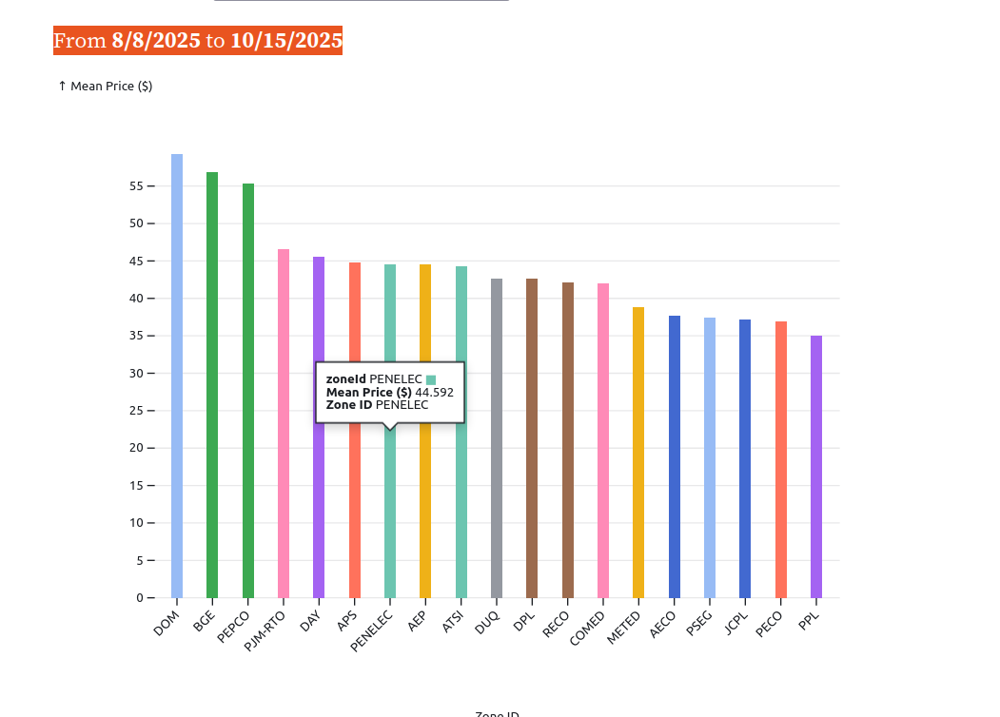

# Semester Project  
**Course:** CS7250       
**Term:**   Fall 2025 – Professor Bogden        
**Team:** Ben Darby & Ben Henshaw  

---

## Title: **It's Electric**  

---

## Topic

Forecasting Electricity Prices by Zone using "like days"

---

## Repository Overview  

This repository contains all materials for our CS7250 semester project

---

## Purpose  
This project's primary objective is to develop a visual analytical interface for energy market participants operating within the PJM Interconnection. The tool's core function is to identify historical analogs by analyzing a set of predictive features related to market prices. A critical constraint is that these features must be known prior to market clearing. The resulting insights will enable users to better forecast zonal Locational Marginal Prices (LMPs) and anticipate price separation between zones, thereby improving risk management and optimizing bidding strategies.
---

# Reproducibility

## Preview




## Getting Started

Follow these instructions to clone the repository, configure, and run the application on your local machine.

### Prerequisites

Before you begin, ensure you have the following installed on your system:
- [Git](https://git-scm.com/)
- [Conda](https://docs.conda.io/en/latest/miniconda.html) (or Miniconda)

### Installation and Configuration

1.  **Clone the Repository**
    After cloning, all subsequent commands should be run from the `project-fall25-darbyatNE` directory.
    ```bash
    git clone https://github.com/nudataviz/project-fall25-darbyatNE
    cd project-fall25-darbyatNE
    ```

2.  **Verify Source Directory**
    Ensure your code is structured correctly. There should be a `src/` directory at the project root containing your `backend.py` file and a `src/static/` directory containing `index.html`.

3.  **Create Environment File**
    At the project root (`project-fall25-darbyatNE/`), create a file named `.env`. This file must contain valid connection details for the PJM API and your AWS RDS database. Add the following keys:
    ```
    PJM_API_KEY=pjm_api_key_here
    USER=database_username
    DB_PASSWORD=database_password
    DB_NAME=database_name
    DB_HOST=aws_rds_endpoint
    DB_PORT=3306_MYSQL_default
    ```

4.  **Create and Activate the Conda Environment**
    The `lmp_env.yml` file contains all necessary Python dependencies.
    ```bash
    conda env create -f lmp_env.yml
    conda activate lmp-env
    ```

### Running the Application

1.  **Run the Development Server**
    With your Conda environment activated and from the `project-fall25-darbyatNE` root directory, run the following command to start the server:
    ```bash
    uvicorn src.backend:app --reload
    ```

2.  **View the Application**
    Open your web browser and navigate to:
    ```
    http://127.0.0.1:8000
    ```


## Feedback

Feedback and suggestions are welcome! Please send your thoughts to:
**darby.b@northeastern.edu  henshaw.b@northeastern.edu**


### Where to Find More Information  
For a detailed overview of our project, please refer to the **[`proposal.md`](proposal.md)** document in this repository.

---
