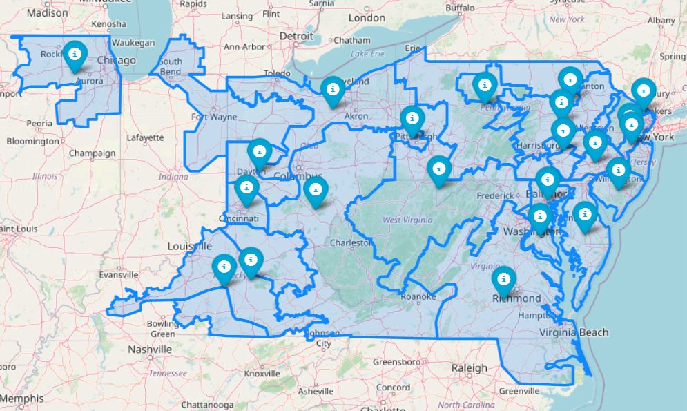

# EDA for It's Electric a PJM Electricity Price Forecasting Project

## Description of Preliminary Results

Initial data processing and exploration have confirmed the viability of the core datasets and highlighted key considerations for the project's next phase. The findings are organized into two main areas: data characteristics and infrastructure planning.

### Data Viability and Characteristics

**1. Geospatial Accuracy**

The geospatial data for PJM load zones has been successfully processed and transformed. As demonstrated below, the resulting shapefiles provide a geographically accurate basemap. This confirms the viability of visualizing key metrics—such as LMPs, load, and weather patterns—directly on the map, which is a core requirement for the project's analytical framework.

*Figure 1: Processed shapefiles accurately rendering PJM load zones, providing the foundation for geospatial analysis.*

**2. Price Data Volatility**

Analysis of the historical Locational Marginal Price (LMP) data reveals significant variability and volatility. This characteristic is ideal for time-series analysis and will enable the creation of dynamic and informative visualizations that effectively highlight periods of congestion and price separation. The richness of the price signal is sufficient to support a robust analytical model.

*Figure 2: Sample time-series of LMP data, demonstrating the high volatility necessary for meaningful analysis.*

### Data Scalability and Infrastructure Planning

The initial sample dataset used for this preliminary analysis is over 60 MB. As we incorporate the full historical depth and breadth of the required data (market, weather, etc.), the complete dataset is projected to be in the **multi-gigabyte (GB) range**.

This scale exceeds the limits of Github storage and transferability at least at the free tier we are enrolled in (e.g., a `.db` file). To ensure the system remains performant, scalable, and accessible for the full scope of the analysis, a critical next step is to **migrate the data pipeline and storage from the current local file to a dedicated database server**. This will allow us t expand the number and type of featurees we can explore and  support more complex, large-scale SQL queries that the project will require to produce meaningful results.

## Challenges
The two largest technical challenges are as follows: 
 * Parsing the text values assigned to datetime_beginning_ept into values that can be compared numerically in selecting a date range. JavaScript's built-in Date object made quick work of turning text into comparable values. This was easy enough to do for dates themselves, but the next version of this graphic will be more granular in its measurement of time intervals, in that our plan is to represent this pricing data on an hourly basis, possibly with more interactive components such as a slider.
 * Adjusting the formatting for such dense data representations was required so that data labels weren't overlapping, but this was accomplished using lambda expressions for the `title` attribute, setting margins for the overall plot, adding an angle to the ordinal group labels along the x axis, and adding an inset to the bars themselves to keep them apart.